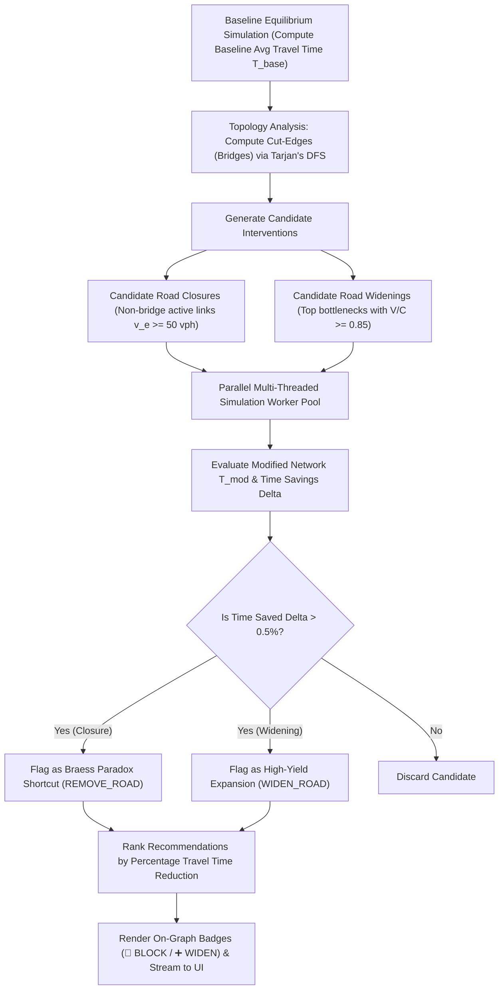

# UrbanFlow Optimization Engine: Technical & Algorithmic Architecture

## 1. Executive Summary

UrbanFlow is an urban traffic network design and simulation engine designed to solve the **Network Design Problem (NDP)**. It identifies:
1. **Braess Paradox Roads**: Roads whose removal or closure paradoxically **reduces** citywide travel times and congestion.
2. **Severe Bottlenecks**: High-congestion corridors whose capacity expansion yields maximum travel time reduction.

---

## 2. Core Mathematical & Traffic Assignment Foundation

### 2.1 Graph & Demand Representation
The road network is modeled as a directed graph $G = (V, E)$, where:
- $V$: Intersections and transit centroids (Nodes).
- $E$: Road segments (Edges/Links) with free-flow travel time $t_0$, capacity $C_e$ in vehicles per hour (vph), lane count $l_e$, and free speed $v_0$.
- $D = \{(o_k, d_k, q_k)\}$: Origin-Destination (OD) demand matrix specifying trips between zone pairs.

### 2.2 Volume-Delay Function (BPR Model)
To account for queueing and congestion as traffic volume increases, link travel times are computed using the **Bureau of Public Roads (BPR)** formulation:

$$t_e(v_e) = t_{0,e} \left[ 1 + \alpha \left(\frac{v_e}{C_e}\right)^\beta \right]$$

- $v_e$: Assigned traffic volume on link $e$ (vph).
- $C_e$: Practical capacity of link $e$ (vph).
- $\alpha, \beta$: Congestion sensitivity parameters (default $\alpha = 0.15, \beta = 4.0$).

### 2.3 User Equilibrium (Wardrop's First Principle)
Under Wardrop Equilibrium, no individual driver can unilaterally reduce their travel time by switching routes:

$$\text{For any OD pair } (o, d), \quad t_p = \min_{p' \in P_{od}} t_{p'} \quad \forall p \in P_{od} \text{ with flow } f_p > 0$$

UrbanFlow computes this equilibrium using the **Method of Successive Averages (MSA)**:
1. **Initialization**: Set link flows $v^{(0)} = 0$, compute free-flow costs $t_e(0) = t_{0,e}$.
2. **Shortest Paths**: For each origin, compute all-pairs shortest paths using single-source Dijkstra.
3. **All-or-Nothing (AON) Assignment**: Assign all OD demand $q_{od}$ to the shortest paths, generating auxiliary flow vector $y^{(k)}$.
4. **Flow Update**: Update link flows using step size $\lambda_k = \frac{1}{k}$:
   $$v^{(k+1)} = (1 - \lambda_k) v^{(k)} + \lambda_k y^{(k)}$$
5. **Cost Update & Convergence**: Recalculate $t_e(v^{(k+1)})$. Stop when the relative flow gap $\frac{\|v^{(k+1)} - v^{(k)}\|_1}{\|v^{(k+1)}\|_1} < \epsilon$ (or max iterations reached).

---

## 3. How the Optimization Engine Evaluates What to Remove & What to Widen

---

### 3.1 Road Removal Optimization (Braess Paradox Detection)

1. **Safety Constraint — Bridge / Cut-Edge Protection**:
   Before evaluating road closures, the engine builds an undirected topological graph $G_{\text{undir}}$ and executes **Tarjan's Bridge-Finding Algorithm** ($O(V + E)$) to identify cut-edges.
   - If edge $e$ is a bridge, closing it would disconnect two city sectors, creating infinite detour times.
   - **Rule**: Bridges are strictly excluded from removal candidates.

2. **Candidate Selection**:
   All non-bridge links carrying active traffic ($v_e \ge 50\text{ vph}$) are queued as candidate closures.

3. **Intervention Simulation**:
   For each candidate $e$, the engine constructs a modified graph $G' = G \setminus \{e\}$ and simulates the new User Equilibrium.

4. **Braess Paradox Detection**:
   The engine computes the citywide percentage change in average trip time:
   $$\Delta T = \frac{T_{\text{baseline}} - T_{\text{modified}}}{T_{\text{baseline}}} \times 100\%$$
   - If $\Delta T > 0.5\%$, **the Braess Paradox is verified**: closing road $e$ forces drivers to choose system-optimal arterial routes, reducing citywide travel times.
   - The road is assigned a `REMOVE_ROAD` recommendation and tagged with an on-graph `🚫 BLOCK` action badge.

---

### 3.2 Road Widening Optimization (Bottleneck Relief)

1. **Candidate Selection**:
   The engine filters the top congested road segments with high volume-to-capacity ratios:
   $$\frac{V}{C} \ge 0.85$$

2. **Capacity Expansion Simulation**:
   For each candidate bottleneck, the engine simulates adding $+1$ lane and expanding capacity by $+50\%$:
   $$l_e' = l_e + 1, \quad C_e' = 1.5 \times C_e$$

3. **Throughput & Speed Gain Calculation**:
   The engine simulates the updated equilibrium and calculates:
   - Travel time reduction percentage $\Delta T$.
   - Network speed gain:
     $$\Delta \text{Speed} = \frac{\bar{v}_{\text{network}}' - \bar{v}_{\text{network}}}{\bar{v}_{\text{network}}} \times 100\%$$

4. **Recommendation Generation**:
   If the capacity addition significantly alleviates upstream queueing without creating downstream Braess traps, it is assigned a `WIDEN_ROAD` recommendation with a `➕ WIDEN` on-graph badge.

---

## 4. Multi-Threaded High-Efficiency Architecture

To ensure instantaneous optimization without exhausting system memory or freezing UI controls:
- **Shared-Memory Worker Pool (`ThreadPoolExecutor`)**:
  Evaluates multiple candidate link interventions concurrently in memory.
- **Zero-Copy Graph Cloning**:
  Network topology modifications reuse adjacency structures and array buffers without duplicating memory.
- **Selective Node & Link Rendering**:
  In dense OpenStreetMap datasets (e.g. Kochi with 1200+ edges), only active origin/destination centroids, selected road endpoints, and key junctions are rendered, keeping rendering latency at a crisp 60fps.

---

## 5. Summary of System Output & UI Interaction

| Visual Element | Meaning | System Behavior on Click |
| :--- | :--- | :--- |
| **`🚫 BLOCK (-X%)`** | Braess Paradox road recommended for closure | Applies closure, updates equilibrium flow, and shows exact minutes saved on all routes |
| **`➕ WIDEN (-X%)`** | Critical bottleneck recommended for expansion | Adds lane capacity, resimulates, and updates network speed telemetry |
| **`Red Dashed Polyline`** | Closed / Blocked road segment | Shows `🚫 CLOSED` badge and rerouted vehicle flows |
| **`Vibrant Blue Polyline`** | Widened road segment | Shows `➕ WIDENED` badge and expanded capacity throughput |
| **`Green / Amber / Red Polylines`** | Live $V/C$ Congestion Levels | Free Flow ($<0.75$), Moderate ($0.75-0.95$), Bottleneck ($\ge 0.95$) |
